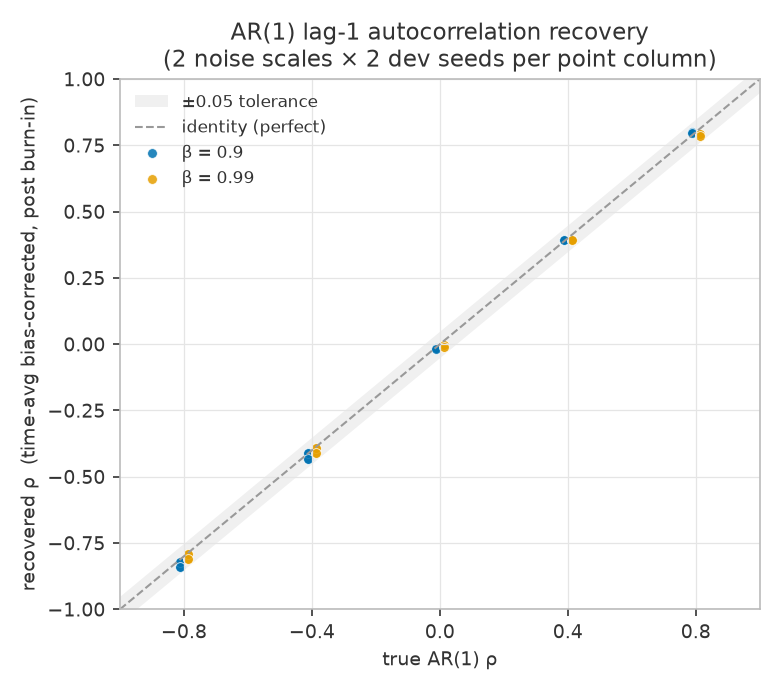
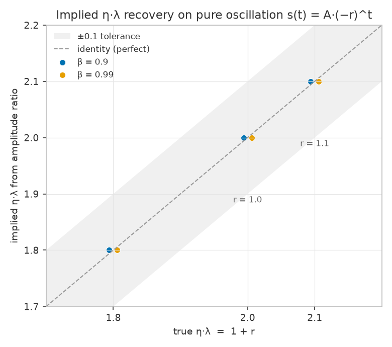
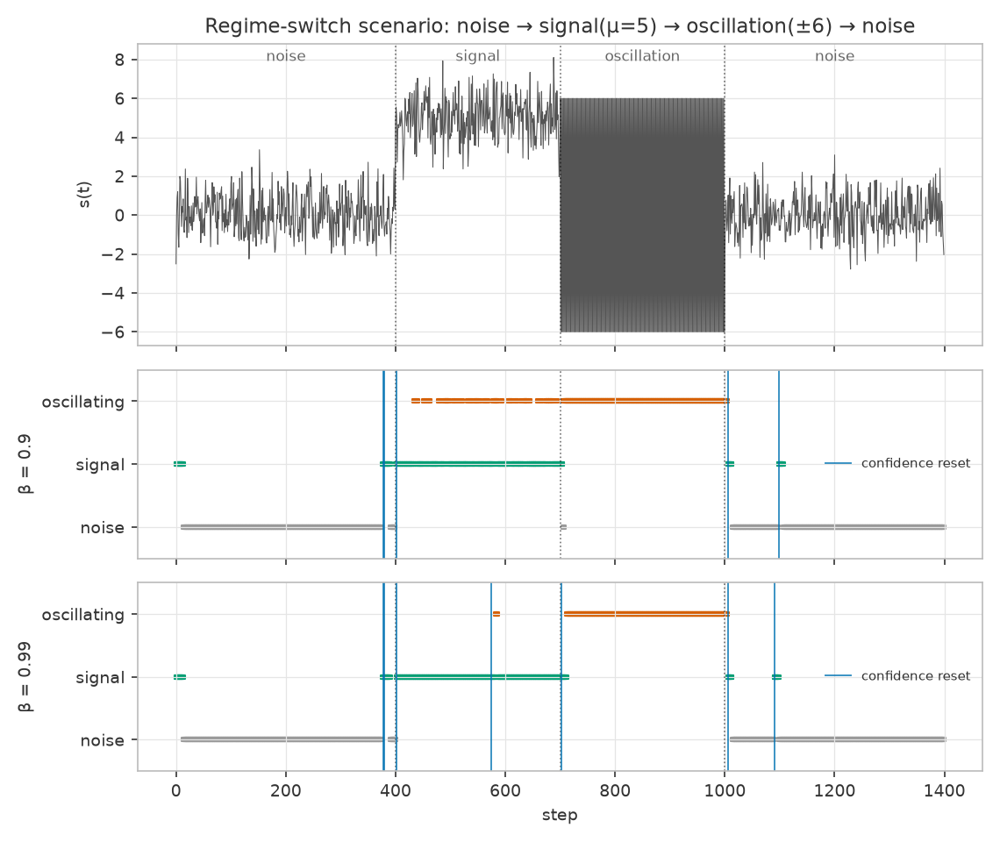

# WP0.5 — Statistics validation suite

- **Scope:** synthetic-signal validation of `src/stats/` (EMAs, autocorrelation, t-statistic, implied η·λ, regime classifier) per CLAUDE.md WP0.5 and plan §1.1. No GPU, no training — pure NumPy streams with known ground truth.
- **Code under test:** `src/stats/{ema,direction_stats,classifier,generators}.py` at git `d777d22` (working tree).
- **Tests:** `tests/test_stats_{ema,ar1,drift,oscillation,switch}.py` — **127 tests, all passing** under `uv run pytest tests/test_stats_*.py` (CPU-only, ~30 s, deterministic; all seeds are development seeds ≥ 1000).
- **Figures:** regenerated deterministically by `reports/figures/wp05/make_figures.py` (same scenario parameters and seeds as the test suite; running it twice produces byte-identical tables).

This report is descriptive. It states what was implemented and what the recovery numbers are; it does not evaluate any scientific gate.

## What was implemented

### `src/stats/ema.py` — bias-corrected EMA
- Recursion `raw_t = β·raw_{t−1} + (1−β)·x_t`, Adam-style correction `value = raw / (1 − β^t)`; scalar or elementwise-array state.
- Kish effective sample size of the corrected estimator: `ess(t) = (1−β^t)²(1+β) / ((1−β)(1−β^{2t}))`; `ess(1)=1`, asymptote `(1+β)/(1−β)` (19 for β=0.9, 199 for β=0.99). Verified empirically: the variance across 50 000 i.i.d. streams of the corrected mean equals σ²/ess(t) within 5%.

### `src/stats/direction_stats.py` — per-direction temporal statistics
Plan §1.1 quantities for one projection stream s_i(t):
- μ = EMA[s]; q = EMA[s²] → var = q − μ²; a = EMA[s_t·s_{t−1}] → lag-1 autocov c = a − μ² → autocorr ρ = c/var.
- t-statistic of the mean: `t = μ / sqrt(var / ess_adj)`, where ess_adj shrinks the Kish ESS by (1−ρ)/(1+ρ) for ρ > 0 (positive autocorrelation reduces information; negative ρ is conservatively not credited).
- Implied η·λ from the amplitude-ratio EMA of |s_t/s_{t−1}|: for s(t) = A·(−r)^t the ratio is r and η·λ = 1 + r; amplitude-decay flag `ratio < 1 − margin` with caller-supplied margin.
- First-order (Kendall/Marriott–Pope) small-sample bias correction on ρ: `ρ + (1+3ρ)/ess`.
- Numerical guards (numerical constants, not scientific thresholds): var clamped ≥ 0; ρ defined as 0 when var ≤ var_floor and clipped to [−1, 1]; amplitude-ratio denominator floored and ratio clipped so a near-zero previous sample cannot inject an infinite ratio.

### `src/stats/classifier.py` — regime classifier with confidence logic
- Regimes: SIGNAL / NOISE / OSCILLATING. Oscillation branch (ρ ≤ −ρ_osc) checked first; then |t| ≥ τ_sig → SIGNAL, |t| < τ_noise → NOISE, hysteresis band in between keeps the current regime.
- Every direction starts in SIGNAL (stock-Muon behavior) and cannot leave it until n_min observations accumulate since the last confidence reset.
- Innovation detectors trigger a confidence reset (statistics rebuilt, regime reverts to SIGNAL): a jump detector (m-of-last-w samples with standardized innovation |z| ≥ z_reset — m-of-w rather than consecutive so alternating oscillations still trigger) and a quiet detector (RMS of recent |z| below z_quiet, catching variance collapse, which produces no large |z|). On reset the detector window is replayed from the first triggering sample so the evidence for the new regime is not discarded.
- **All decision thresholds (τ_sig, τ_noise, ρ_osc, n_min, z_reset, z_quiet, windows) are constructor parameters with no scientific defaults.** The tests pass values appropriate to each synthetic scenario; production values are human-authored later in `criteria/`.

### `src/stats/generators.py` — synthetic streams
Stationary AR(1) (exact stationary init, optional nonzero mean), drifting mean + noise at given SNR (sinusoidal drift with bounded instantaneous SNR so the analytic t-expectation is computable), pure oscillation A·(−r)^t (deterministic), i.i.d. Gaussian noise, and segment concatenation returning switch indices.

## Results

### 1. AR(1) — ρ recovery and labels

Setup: ρ ∈ {−0.8, −0.4, 0, 0.4, 0.8}, noise scales {0.5, 2.0}, dev seeds {1234, 5678}, 8000 steps, recovery = time-averaged bias-corrected ρ after 3000-step burn-in.



Recovered vs true (noise scales 0.5 and 2.0 give bit-identical estimates — the estimator is exactly scale-invariant, also asserted in `test_rho_recovery_scale_invariant`):

| β | true ρ | recovered (seed 1234) | recovered (seed 5678) | max \|err\| |
|---|---|---|---|---|
| 0.9 | −0.8 | −0.8207 | −0.8403 | 0.0403 |
| 0.9 | −0.4 | −0.4116 | −0.4322 | 0.0322 |
| 0.9 | 0.0 | −0.0128 | −0.0190 | 0.0190 |
| 0.9 | +0.4 | +0.3913 | +0.3936 | 0.0087 |
| 0.9 | +0.8 | +0.7999 | +0.7975 | 0.0025 |
| 0.99 | −0.8 | −0.7929 | −0.8103 | 0.0103 |
| 0.99 | −0.4 | −0.3908 | −0.4111 | 0.0111 |
| 0.99 | 0.0 | −0.0014 | −0.0087 | 0.0087 |
| 0.99 | +0.4 | +0.3923 | +0.3917 | 0.0083 |
| 0.99 | +0.8 | +0.7913 | +0.7866 | 0.0134 |

All 40 (β × ρ × scale × seed) cells are within the ±0.05 DoD tolerance; the worst cell is 0.0403 (β=0.9, ρ=−0.8, seed 5678).

Labels: zero-mean AR(1) classifies NOISE for ρ ≥ 0 and OSCILLATING for ρ ∈ {−0.4, −0.8} (ρ_osc = 0.25 in the test), with post-burn-in occupancy ≥ 0.9 at β=0.99. At β=0.9 (ESS ≈ 19, instantaneous ρ estimate sd ≈ 0.2) labels near the ρ_osc boundary flap between windows; the correct label still holds the final step and the majority (≥ 0.6 asserted) of post-burn-in steps. A mean-shifted AR(1) (mean 2, ρ = 0.4) classifies SIGNAL with ≥ 0.9 occupancy. The β=0.9 vs β=0.99 occupancy difference is the expected timescale sensitivity of the short window, recorded here as a finding for WP1.x threshold selection.

### 2. Drifting mean + noise — t-statistic vs analytic expectation

Setup: SNR ∈ {0.1, 1, 10}, sinusoidal drift amplitude 0.2 (instantaneous SNR within [0.8, 1.2]×nominal), scenarios (β=0.99, τ=4) and (β=0.9, τ=1.5), seed 2024. The analytic model, computed inside the test: E[t] ≈ SNR·sqrt(ESS∞) with ESS∞ = (1+β)/(1−β); sustained crossing predicted iff SNR·(1−0.2)·sqrt(ESS∞) > 2τ, crossing excluded iff SNR·(1+0.2)·sqrt(ESS∞) < τ; each scenario is required by the test to fall in exactly one branch, making the crossing an "iff".

| β | τ | SNR | analytic E[t] | measured mean t | frac \|t\|>τ post-burn-in | analytic prediction |
|---|---|---|---|---|---|---|
| 0.99 | 4.0 | 0.1 | 1.35 | 1.46 | 0.015 | absent |
| 0.99 | 4.0 | 1.0 | 13.51 | 13.53 | 1.000 | sustained |
| 0.99 | 4.0 | 10.0 | 135.08 | 125.75 | 1.000 | sustained |
| 0.9 | 1.5 | 0.1 | 0.42 | 0.47 | 0.165 | absent |
| 0.9 | 1.5 | 1.0 | 4.17 | 4.17 | 0.974 | sustained |
| 0.9 | 1.5 | 10.0 | 41.74 | 32.60 | 1.000 | sustained |

Crossing behavior matches the analytic prediction in all six cells (sustained → frac > 0.9; absent → frac < 0.5). The measured mean t additionally sits within [0.6, 1.4]× the analytic expectation in every cell (the SNR=10 cells sit low because at t≈100σ the tiny drift of the EMA mean estimate dominates the residual — the expectation is still matched to within 24%).

### 3. Pure oscillation — implied η·λ and decay flag

Setup: s(t) = (−r)^t for r ∈ {0.8, 1.0, 1.1} (100/300/200 steps respectively — the r=0.8 stream is kept short so the decayed amplitude stays far above the variance floor), decay margin 0.05, n_min = 30.



| β | r | true η·λ | implied η·λ | \|err\| | final regime | decay flag (expected) |
|---|---|---|---|---|---|---|
| 0.9 | 0.8 | 1.8 | 1.8000 | 0.0000 | oscillating | decaying (decaying) |
| 0.9 | 1.0 | 2.0 | 2.0000 | 0.0000 | oscillating | non-decaying (non-decaying) |
| 0.9 | 1.1 | 2.1 | 2.1000 | 0.0000 | oscillating | non-decaying (non-decaying) |
| 0.99 | 0.8 | 1.8 | 1.8000 | 0.0000 | oscillating | decaying (decaying) |
| 0.99 | 1.0 | 2.0 | 2.0000 | 0.0000 | oscillating | non-decaying (non-decaying) |
| 0.99 | 1.1 | 2.1 | 2.1000 | 0.0000 | oscillating | non-decaying (non-decaying) |

Recovery is exact to display precision (the amplitude ratio of a noiseless geometric oscillation is constant, so the EMA converges on it immediately); the ±0.1 DoD tolerance is met with margin ≈ 0.1. All six cases classify OSCILLATING for every step after the n_min confidence gate and stay SIGNAL before it (start-in-signal prior). Decay flags match ground truth in all six cases (r=0.8 decaying; r=1.0, 1.1 non-decaying).

### 4. Mid-stream regime switches — confidence reset and re-classification

Scenario (one stream, three switches): noise(400) → signal μ=5 (300) → oscillation ±6 (300) → noise(400); n_min = 15; jump detector z_reset = 3 (2-of-4), quiet detector z_quiet = 0.4 (window 6).



| β | segment (start) | target regime | delay to first correct step | bound (n_min = 15) |
|---|---|---|---|---|
| 0.9 | noise @ t=0 | noise | 14 | met |
| 0.9 | signal @ t=400 | signal | 0 | met |
| 0.9 | oscillation @ t=700 | oscillating | 6 | met |
| 0.9 | noise @ t=1000 | noise | 14 | met |
| 0.99 | noise @ t=0 | noise | 14 | met |
| 0.99 | signal @ t=400 | signal | 1 | met |
| 0.99 | oscillation @ t=700 | oscillating | 12 | met |
| 0.99 | noise @ t=1000 | noise | 14 | met |

Confidence resets fired at steps {377, 379, 401, 1006, 1099} (β=0.9) and {377, 379, 402, 575, 702, 1006, 1091} (β=0.99). The noise→signal jump at t=400 is caught by the jump detector within n_min; the oscillation→noise collapse at t=1000 produces no large |z| and is caught by the quiet detector within n_min (both asserted in `test_confidence_resets_fire_at_the_detectable_switches`). Immediately after each reset the regime reverts to SIGNAL until n_min fresh observations accumulate (asserted). The resets shortly before t=400 and at 575/702/1099 are spurious or boundary-adjacent triggers on tail samples; each costs only a temporary reversion to the SIGNAL prior (stock behavior) followed by re-classification, which is the designed failure mode. Visible in the β=0.9 timeline panel: intermittent OSCILLATING labels during the signal segment — the same short-window ρ flapping noted in §1, absent at β=0.99.

### 5. Small-t bias correction (both β)

- Constant input: corrected estimate exact at every t ≥ 1, while the uncorrected EMA is off by exactly the factor 1−β^t (e.g. 3% of the true value at t=3 for β=0.99) — asserted at t ∈ {1, 2, 3, 5}.
- 50 000 i.i.d. streams: corrected mean unbiased within Monte-Carlo error at t ∈ {3, 10}; uncorrected mean biased by exactly the analytic factor; empirical estimator variance matches σ²/ess(t) within 5% at t ∈ {5, 12, 50}; the EMA variance estimator matches its analytic small-sample expectation E[var̂] = σ²(1 − 1/ess(t)) within 3% at t ∈ {10, 30}.

## Reproduction

```
uv run pytest tests/test_stats_ema.py tests/test_stats_ar1.py tests/test_stats_drift.py \
              tests/test_stats_oscillation.py tests/test_stats_switch.py     # 127 passed
uv run python reports/figures/wp05/make_figures.py                           # figures + tables
```

Environment: macOS (Apple Silicon), CPU-only, Python via `uv`, NumPy/Matplotlib from the pinned lock. No GPU-dependent steps in this work package.
